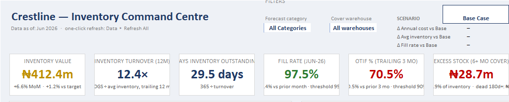
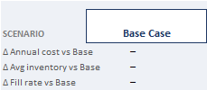
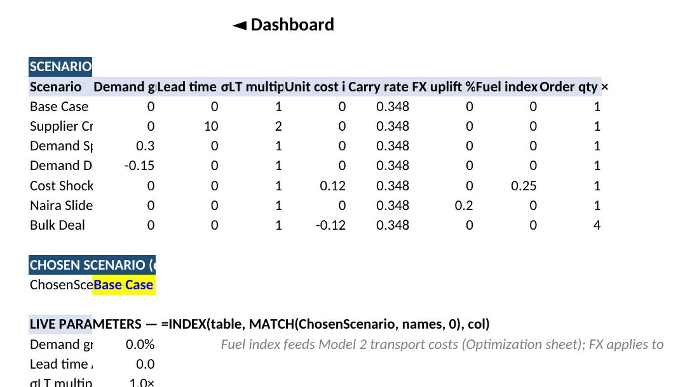

# Crestline inventory decision-support system

**What happens to the business if demand spikes next month? If a key supplier goes quiet? If the naira slides another 20%?**

Most inventory dashboards can only tell you what already happened. This one is built to answer "what happens if" before you spend a naira on it. It's an Excel model for a fictional five-warehouse distributor in Nigeria, and it exists so a purchasing manager can test a decision against seven different business conditions before committing working capital to it.


---

## The problem this solves

Crestline Distribution Ltd (fictional, more on that below) runs five warehouses across Lagos, Ibadan, Abuja and Port Harcourt, moving beverages, food staples, home care and personal care products. Like any distributor, it can lose money in two opposite directions at once.

Carry too much stock and cash gets tied up in a warehouse instead of the business. Carry too little and a stockout turns into a lost sale, or worse, a lost customer. The tempting answer is "just minimize inventory," but that's the wrong question. The real one is: what's the right inventory position given demand, lead times, cost, and how much risk the business can stomach right now?

That's a moving target. Demand shifts. Suppliers slip. The naira does what the naira does. A static dashboard can't keep up with that, so this isn't one.

## What it actually does

At the center of the workbook is a scenario engine. Pick a condition from a dropdown and every downstream number, inventory value, fill rate, days of stock on hand, working capital exposure, recalculates against it. Base case is the reference point everything else gets measured against. From there, seven conditions are built in: a supplier crisis that doubles lead times, a demand spike of 30%, a demand decline of 15%, a 12% cost shock on procurement, and a naira slide that adds a 20% FX uplift to imported cost lines (modeled as a stress test, not a currency prediction).

The last one, bulk deal, is where I'd point a hiring manager first. A supplier offers a discount if you order four times the usual quantity. On paper that's a cheaper unit cost. Run it through the model and you see what four times the inventory actually costs in storage and tied-up cash, and the discount stops looking automatic. That's the whole point of the exercise: the model forces the comparison instead of letting the headline number speak for itself.

Switching scenarios doesn't just change a number in a cell. It flows through inventory value, reorder points, warehouse-level fill rates, and a set of executive KPIs, so a manager can see the full consequence of a decision, not just the headline figure.

## The dashboard

The KPI band: inventory value, turnover, days of inventory outstanding, fill rate, OTIF, and excess stock, all reacting to whichever scenario is selected.



The scenario switcher, the control panel for the whole model. Pick a scenario and see the delta against base case for annual cost, average inventory, and fill rate.



And the what-if table underneath it, showing the actual assumptions behind each scenario so anyone reviewing the model can see exactly what changed and why the numbers moved.



## How it's built

Everything runs on formulas, not macros. Raw data flows in from CSVs covering products, suppliers, warehouses, purchase orders, transfers, stock counts, sales across five regions, transport costs, and a lost-sales log. From there:

```
Raw data → inventory calculations → demand analysis → scenario engine → executive dashboard
```

The scenario logic sits in one control table (an INDEX/MATCH lookup keyed to a named "chosen scenario" cell), which every downstream calculation references. Change the dropdown, and the whole model recalculates from that single source of truth. No hidden hardcoded numbers, no separate copies of the workbook per scenario.

## What this is not

Crestline doesn't exist. The data is synthetic, generated to look and behave like a real FMCG distribution business, but no real transactions, suppliers, or customers are involved. Any financial figures in the workbook are modeled outputs from stated assumptions, not audited results, and I've been careful in the documentation not to blur that line. If you see a number like "modeled potential working-capital release," that's exactly what it is: a scenario estimate, not a claim that money actually moved.

I built it this way on purpose. A portfolio project that quietly implies real savings isn't more impressive, it's just less honest, and it's the kind of thing that falls apart under questioning in an interview.

## Repository structure

```
crestline-inventory-decision-support/
├── README.md
├── solution/
│   └── Crestline_Inventory_Decision_Support_System.xlsx
├── requirements/
│   └── BUSINESS_REQUIREMENTS.md
├── methodology/
│   └── SCENARIO_METHODOLOGY.md
├── data/
│   ├── dim_customers.csv
│   ├── dim_employees.csv
│   ├── dim_products.csv
│   ├── dim_suppliers.csv
│   ├── dim_warehouses.csv
│   ├── inventory_transactions.csv
│   ├── lost_sales_log.csv
│   ├── month_end_inventory.csv
│   ├── purchase_order_lines.csv
│   ├── returns.csv
│   ├── sales_abuja.csv
│   ├── sales_ibadan.csv
│   ├── sales_lagos_annex.csv
│   ├── sales_lagos_main.csv
│   ├── sales_port_harcourt.csv
│   ├── stock_counts.csv
│   ├── storage_costs.csv
│   ├── transfers.csv
│   └── transport_costs.csv
└── screenshots/
    ├── dashboard_kpi_band.png
    ├── scenario_switcher.png
    └── scenario_whatif_table.png
```

[`BUSINESS_REQUIREMENTS.md`](requirements/BUSINESS_REQUIREMENTS.md) has the full requirements and solution spec. [`SCENARIO_METHODOLOGY.md`](methodology/SCENARIO_METHODOLOGY.md) covers how each scenario is defined, validated, and meant to be interpreted, including where the model draws the line between observed data, calculated results, and modeled estimates.

## Where this would need work before going live

This is portfolio work, and I want to be upfront about the gap between that and production. A real deployment would need live ERP integration, data refresh controls, user permissions, and a validation process running on a schedule, not just a one-time build. None of that is in scope here. What is in scope: proving the modeling logic holds up, the scenario math is sound, and the decision framework is one a business could actually use.

## About me

I work as a data analyst, and I build things like this because I'd rather show the thinking than describe it. If you want to talk about the model, the assumptions behind it, or how I'd approach something similar with real data, reach me at oluwafikayore@gmail.com.
